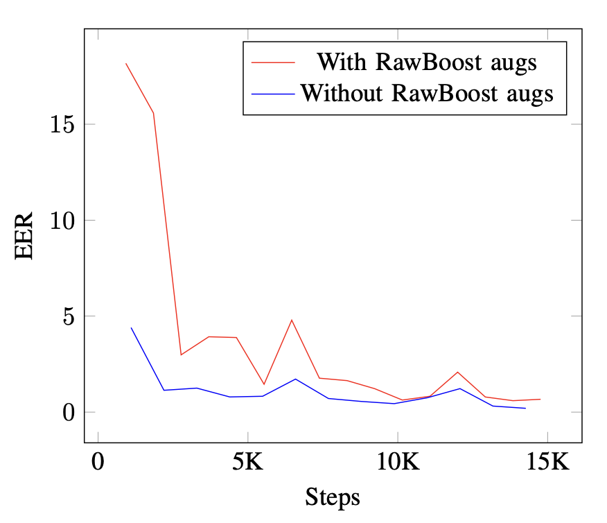

# SafeSpeak-2024

## **1. Introduction**
Spoofing attacks such as text-to-speech, voice conversion, and replay attacks pose significant challenges to the security of voice-based systems. The SafeSpeak-2024 competition aims to advance anti-spoofing methods by benchmarking solutions on a large-scale dataset using the Equal Error Rate (EER) as the primary evaluation metric.

## **2. Problem Statement and Evaluation Metric**
The task is a binary classification problem:
- **Label 1:** Bona fide (authentic) audio recordings.
- **Label 0:** Spoofed audio recordings.

The evaluation metric for the competition is **Equal Error Rate (EER)**, which balances the trade-off between false acceptances and false rejections. Lower EER indicates better performance.

## **3. Dataset and Preprocessing**
Since no training data was provided by the organizers, I utilized publicly available datasets ASVspoof 2019 and ASVspoof 2021.
### **3.1 Train Set**
Training set consist from train and eval sets from both dataset:
- **ASVspoof 2019:**
  - **Train set:** All samples.
  - **Eval set:** 75% of random spoofed samples $\cup$ 75% of random bona fide samples
- **ASVspoof 2021:**
  - **Eval set:** 11K samples that are misranked by **RawNet2** (scores are avaliable in official dataset metadata).

### **3.2 Validation Set**
Validation set consist only from part of eval set from ASVspoof 2019:
- **ASVspoof 2019:**
  - **Eval set:** remaining 25% of spoofed samples $\cup$ remaining 25% of bona fide samples.

The dev set was not utilized, as internal tests revealed that its low informativeness and limited size made it less suitable for this task.

### **3.3 Preprocessing**
In validation and testing phases to standardize input sizes:
- **Trimming:** Audio recordings longer than 64,600 timestamps were trimmed to the first 64,600 timestamps.
- **Looping:** Recordings shorter than 64,600 timestamps were looped to reach exactly 64,600 timestamps.

Each audio sample was represented by 64,600 timestamps, ensuring consistent input dimensions across training, validation, and testing.

### **3.4 Augmentation**
During training:
- For recordings longer than 64,600 timestamps, a random 64,600 timestamp segment was selected.
- For shorter recordings, looping was applied.

I experimented with augmentations from RawBoost, but they did not yield improvements, likely due to instability in convergence and a lack of time for experiments. Comparison of influence of RawBoost augmentations on **EER** metric on validation set for my pipeline illustrated below.

## **4. Model Architecture**
The backbone of our solution is the **AASIST2** model, enhanced with pretrained representations:
1. **XLS-R:** Pretrained wav2vec features for robust audio representation.
2. **AASIST (v1):** Pretrained weights for initializing the core model.

## **5. Training**
### **5.1 Loss**
I used **Additive Angular Margin Softmax (AM-Softmax)** as in **AASIST2** traning pipeline with scale of 15 and margin of 0.3. Also I experimented with **MSE-based P2SGrad** loss, which did not produce meaningful improvements in my case.

### **5.2 Optimization**
- **Optimizer:** Adam with weight decay of 0.0001.
- **Learning Rate Scheduler:** CosineAnnealingLR with:
  - Initial learning rate: **0.0001**.
  - Final learning rate: **1e-8**.
- **Batch Size:** 16.
- **Number of Epochs:** 30.

### **5.3 Sampling Strategy**
To address class imbalance weighted sampling with undersampling of the majority class was employed, ensuring balanced representation of both labels.

## **6. Results**
The results table below shows the results of various submission on public test with their description. It is worth noting that the pretrained weights **AASIST2** and **AASSIST** differ in that **AASIST2** also contains weights for **wav2vec 2.0**, which is indicated by the symbol * in the table.

| **Model**   | **Addons**                                   | **Public EER** |
|-------------|----------------------------------------------|----------------|
| Baseline    | —                                            | 1.49447        |
| AASIST      | Pretrained weights                          | 0.96636        |
| AASIST2     | Pretrained weights*                         | 0.53358        |
| AASIST2     | Pretrained weights* + ASVspoof 2021 data + AM-Softmax | 0.23140        |
